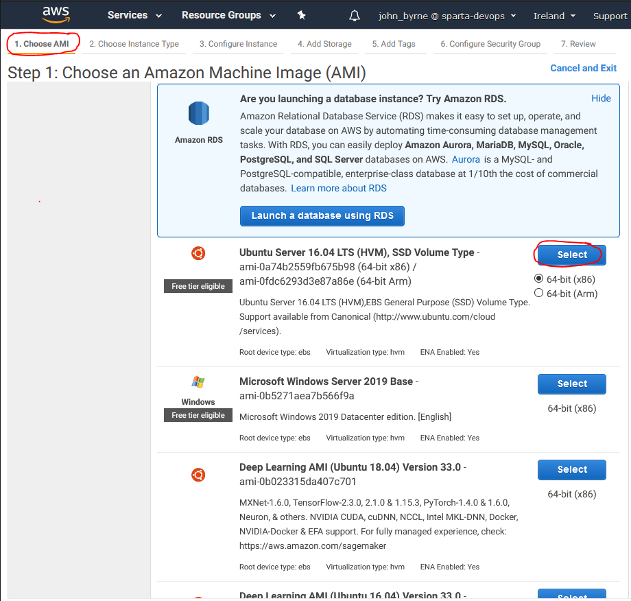
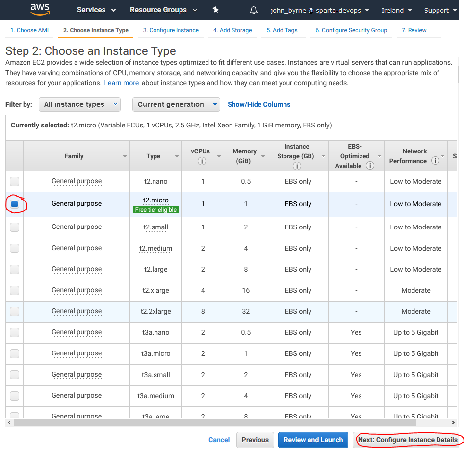
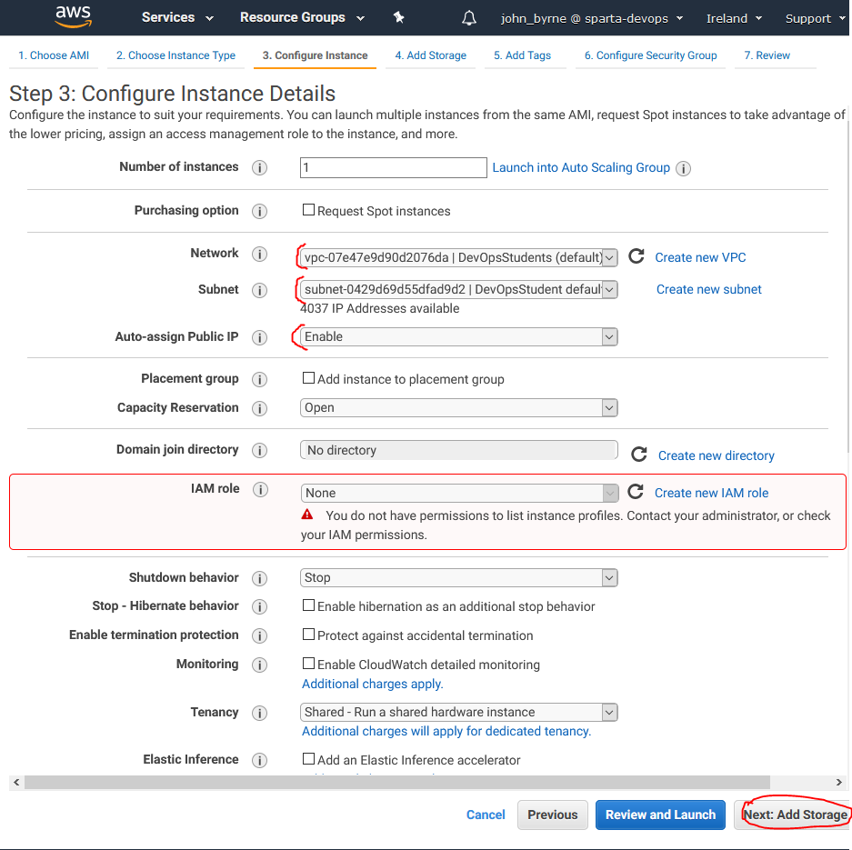
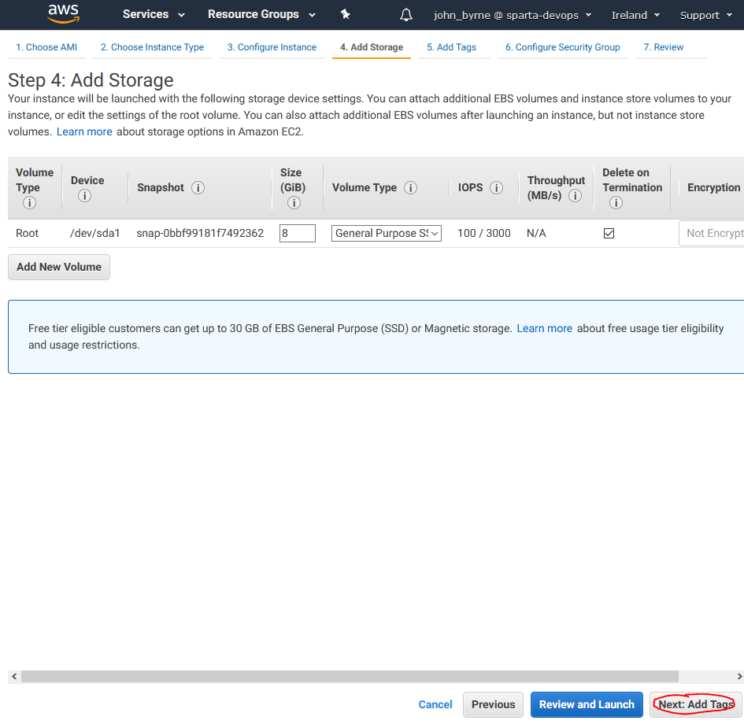
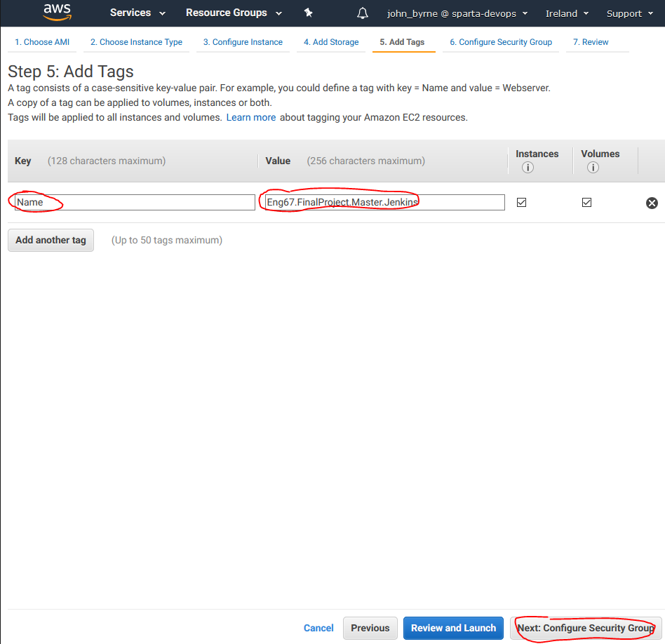

# CI / CD Pipeline using Jenkins

We are going to be creating the Continuous Integration and Delivery steps within our End to End pipeline using the automation tool **Jenkins**.

To host this we are going to be making use of **AWS**, A.K.A **Amazon Web Services**. They are going to provide us with Virtual Machines known as **EC2** instances hosted on their cloud service.

More Information (Cick Here)

 
  
<pre>

### Further Information on Key Words

1. _**What is Jenkins?**_ - Jenkins is an automation server commonly used to support building, deploying and automating any project pipeline. It is open source, meaning there are thousands of amazing plugins.
2. _**What is AWS**_ - Amazon Web Services is an on-demand cloud platform that provides services to companies requiring database storage, content delivery, or other functionality.
3. _**What is a EC2**_ - A Service on AWS it stands for _Amazon Elastic Compute Cloud_ is a web service that provides secure, resizable compute capacity in the cloud. Designed to make web-scaling easier and allows access to VMs on Amazons computing environment.
4. _**VPC**_ - 
5. _**Subnet**_ - 

</pre>

Below is the steps we took to set up this part of the Pipeline.

### Step 1. Setting up our Jenkins Instance

Go to Amazon Web Services Console and navigate to the EC2 Service, from there select **Create Service**.

Then Choose the **Ubuntu 16.04 LTS (HVM)** on **64-bit(x86)**.

Now Choose the **t2.micro** type, this is big enough as we are only running small jobs on our server.

Configure the instance so it is attached to a VPC, Subnet and Auto-assign public IP. Make sure you attach it to your own VPC if you have one.

For storage, leave it as it is as this is enough for our server. If it was bigger 8GB may not be enough.

Now give the Instance a memorable and meaningful name as this is what it will appear as in the instances dropdown.

For the Security Group, you need to create a set of necessary inbound and outbound rules. These will allow access into our server with specific access rights. I already had a pre-made security group so I used that but you can go ahead and create your own.

The Security group rules should look like so:

**Inbound Rules**

| **Type**   | **Protocol** | **Port range** | **Source**      | **Description**                  |
|------------|--------------|----------------|-----------------|----------------------------------|
| HTTP       | TCP          | 80             | 0.0.0.0/0       | HTTP Access                      |
| HTTP       | TCP          | 80             | ::/0            | HTTP Access                      |
| Custom TCP | TCP          | 8080           | 0.0.0.0/0       | Jenkins Default Port             |
| Custom TCP | TCP          | 8080           | ::/0            | Jenkins Default Port             |
| SSH        | TCP          | 22             | <your_ipv4>/32  | SSH From your IP                 |
| SSH        | TCP          | 22             | <slave_ipv4>/32 | SSH From Slave Node              |
| SMTP        | TCP          | 25             | 0.0.0.0/0 | Allow Emails to be sent on SMTP Port               |
| SMTP        | TCP          | 25             | ::/0 | Allow Emails to be sent on SMTP Port              |
| Custom TCP | TCP          | 3000           | 0.0.0.0/0       | NodeJS default Port              |
| Custom TCP | TCP          | 3000           | ::/0            | NodeJS default Port              |
| HTTPS      | TCP          | 443            | 0.0.0.0/0       | HTTPS Access                     |
| HTTPS      | TCP          | 443            | ::/0            | HTTPS Access                     |
| Custom TCP | TCP          | 9007           | 0.0.0.0/0       | Allow Slave access  on this Port |
| Custom TCP | TCP          | 9007           | ::/0            | Allow Slave access on this Port  |

**Outbound Rules**

| **Type**    | **Protocol** | **Port range** | **Source** | **Description**       |
|-------------|--------------|----------------|------------|-----------------------|
| All traffic | All          | All            | 0.0.0.0/0  | Allow All Traffic Out |

